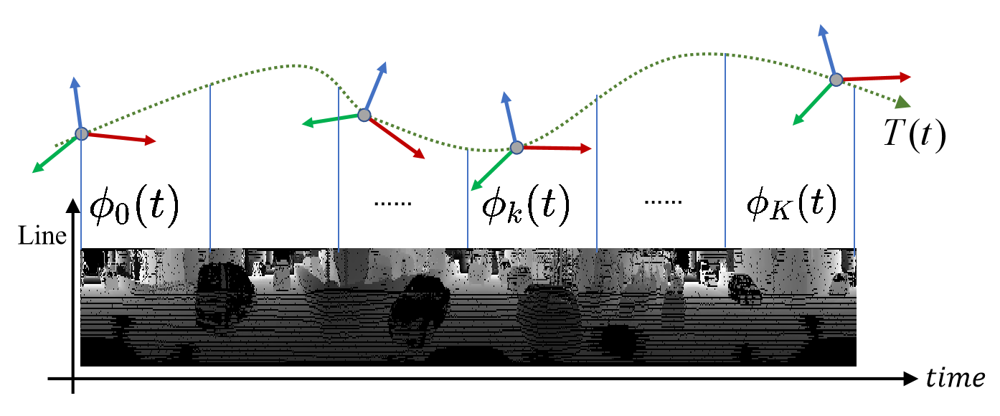
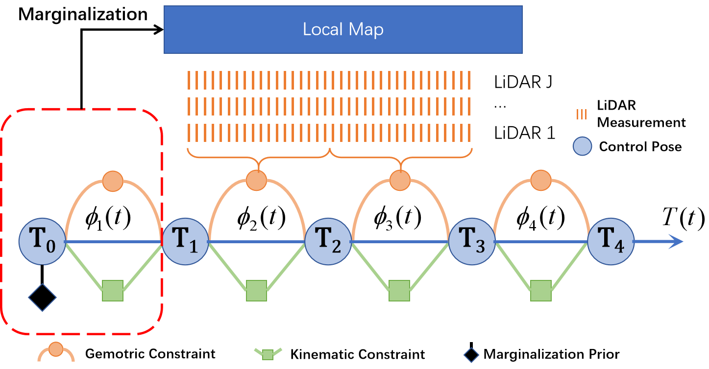

## ROS2 fork for Traj-LO algorithm

This fork contains lightweight (no GUI) ROS2 implementation of the Traj-LO repository by [@kevin2431](https://github.com/kevin2431) and the [paper](https://ieeexplore.ieee.org/document/10387726) for trajectory estimation.

Tested and successfully run on ROS2 Humble on Ubuntu 22.04.

### Installation
1. `mkdir -p ros2_ws/src && cd ros2_ws`
2. `git clone --recursive https://github.com/bilgineroral/Traj-LO.git ./src/Traj-LO`
3. `./src/Traj-LO/src/scripts/install_deps.sh`
4. `source /opt/ros/humble/setup.sh` (adjust this to your ROS2 installation path)
5. `colcon build --symlink-install --packages-select trajlo`

### Running
1. From the root of the workspace (`ros2_ws` directory), run `source install/setup.sh` to source the overlay. Run the Traj-LO algorithm with `ros2 run trajlo trajlo ./src/Traj-LO/data/config_ouster.yaml`. Do not forget to adjust the topic name to your ROS2 bag's topic name. Note that the algorithm runs only with config_ouster.yaml for now.
2. After running the algorithm, open up another terminal, source your ROS2 installation, then run `ros2 bag play your_rosbag_folder` to start playing your ros2 bag.
3. The algorithm publishes the estimated trajectory information on topic `/trajlo_pose` with message type `geometry_msgs/msg/PoseStamped`. In order to record the estimated trajectory, open up another terminal, source your ROS2 installation and run `ros2 bag record -o output_bag /trajlo_pose`. After the `ros2 bag play` command publishes all of its messages, you may simply `Ctrl^C` do stop recording.
4. Finally, you may use the [evo](https://pypi.org/project/evo/) package to evaluate the trajectories after being saved in a ROS2 bag.

<div align="center">
    <h1>Traj-LO</h1>
    <i>A LiDAR-only Odometry from Continuous-Time perspective</i>
    <br>
    <br>
<div>

[🛠️ Installation](#Installation) |
[🎥 Video](https://youtu.be/hbtKzElYKkQ?si=ZlqvtUVhhJbAju0S) |
[📖 Paper](https://ieeexplore.ieee.org/document/10387726)

</div>
    <br>
    
    
<br>
</div>


## What is Traj-LO
**Traj-LO aims to explore the limits of state estimation using only LiDAR sensors.**

Nowadays, LO approaches heavily rely on IMU data for accurate state estimation but neglect the true capabilities of LiDAR sensors. Through the continuous-time perspective, Traj-LO matches the performance of state-of-the-art LIO methods in diverse scenarios.

The spatial-temporal movement of LiDAR is parameterized by a simple yet effective continuous-time trajectory, which consists of multiple piecewise linear functions.
By coupling the geometric information from streaming LiDAR points and kinematic constraints from trajectory smoothness, it can work even in scenarios where the motion state exceeds the IMU's measuring range.
Besides, the framework is generalized for different kinds of LiDAR as well as multi-LiDAR systems.
## How to use Traj-LO (ROS2)

Follow [installation](#Installation) and [running](#Running) sections above to run Traj-LO with your ROS2 bags. Currently, the released code only supports one LiDAR configuration. The corresponding configuration files are located in the "data" directory. For optimal performance, you will need to fine-tune the parameters.

Since Traj-LO is a LiDAR-only method, it may fail in narrow spaces where there are few valid points for a long time.

### Dependency
In addition to the ROSbag data loader, Traj-LO also provides a simple custom GUI for visualization and uses Eigen-based Gauss-Newton for pose optimization. Here are the major libraries we will use.
- Optimization: [Eigen](https://gitlab.com/libeigen/eigen.git), [Sophus](https://github.com/strasdat/Sophus.git)
- DataLoader: oneTBB, Boost

Although major dependencies are included in the third-party folder, you may still need to run the script `install_deps.sh` to install libraries like Boost, etc.


### Some Tips
- Traj-LO is a continuous-time method, so each point in your rosbag should have a corresponding timestamp.
- When the motion profile is aggressive, you can decrease `seg_interval` or increase `kinematic_constraint`.

## Cross-platform Support
### Linux
Ubuntu 22.04
### Windows
You can use [WSL2](https://learn.microsoft.com/zh-cn/windows/wsl/about) to install the Ubuntu subsystem and then follow the above instructions to test Traj-LO.
### MacOS
Make sure you have [Homebrew](https://brew.sh/) to run the srcipt `install_deps.sh`to install dependencies. We have tested Traj-LO on M2 Mac Mini (macOS 14.4.1).

## Citation

If you use this project for any academic work, please cite RA-L [paper](https://ieeexplore.ieee.org/document/10387726).

```bibtex
@ARTICLE{zheng2024traj,
    author={Zheng, Xin and Zhu, Jianke},
    journal={IEEE Robotics and Automation Letters},
    title={Traj-LO: In Defense of LiDAR-Only
    Odometry Using an Effective Continuous-Time
    Trajectory},
    year={2024},
    volume={9},
    number={2},
    pages={1961-1968},
    doi={10.1109/LRA.2024.3352360}
}
```

For those interested in multi-sensor fusion, particularly in multi-LiDAR and multi-IMU systems, I recommend checking out [Traj-LIO](https://arxiv.org/abs/2402.09189), which is a resilient state estimator through sparse Gaussian Processes.

## Acknowledgement
Thanks for these pioneering works [Basalt](https://cvg.cit.tum.de/research/vslam/basalt) (Batch Optimization), [CT-ICP](https://github.com/jedeschaud/ct_icp) (Continuous-time Idea), and [KISS-ICP](https://github.com/PRBonn/kiss-icp) (VoxelMap Management).


